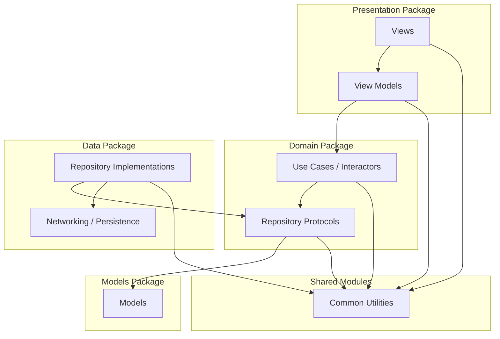

# Proton Authenticator
This repository contains the source code for the Proton Authenticator application. 

* [Installation](#installation)
* [Technical Choices](#technical-choices)
    * [Project Architecture Overview](#project-architecture-overview)
    * [Architecture Diagram](#architecture-diagram)
    * [Dependency manager](#dependency-manager)
    * [Modularization](#modularization)
* [Debug](#debug)
    * [Debug network traffic](#debug-network-traffic)
    * [Debug Sentry activities](#debug-sentry-activities)
* [Tools](#tools)
	* [Dependency injection](#dependency-injection) 
	* [SwiftLint](#swiftlint)
	* [SwiftFormat](#swiftformat)
    * [Sourcery](#sourcery)
* [Changelog](#changelog)
* [Contributing](#contributing)
* [License](#license)

# Installation

The app targets iOS 18 and above. Make sure you have Xcode 16+ installed, check out the repo and open `Authenticator.xcodeproj` to run the project.

# Technical Choices

## Project Architecture Overview

This document outlines our project structure based on a layered (Clean Architecture) approach. 
The code is organized into local Swift packages to enforce separation of concerns and improve maintainability. 

The main layers are:
    •    Entities: Core domain models (data structures).
    •    Domain: Business logic including use cases and repository protocols.
    •    Data: Concrete implementations for data operations (networking, persistence).
    •    Presentation: UI components, views, and view models.
    
## Architecture Diagram

Below is a Mermaid diagram that visualizes the dependency flow between the layers:



## Package Functions

### Models Package

- Purpose:
Contains the fundamental data models (the “entities”) that represent your domain objects. 
These should be simple, framework-agnostic, and ideally immutable value types (structs).

- Examples:
    
```swift
// User.swift
public struct User {
    public let id: String
    public let name: String
}
```
### Domain Layer (Domain Package)

- Purpose:
Holds the core business logic of your application. This layer is independent of any external frameworks or data sources, making it highly testable and reusable. It defines what the app does, not how it does it.

- What to Include:
    •    Use Cases: These encapsulate specific business operations (e.g., “Log in a user”, “Fetch articles”) and orchestrate the work of various repositories or domain services.
    •    Repository Protocols: Define the interfaces for data operations without committing to an implementation. The domain layer shouldn’t know about networking, persistence, etc.
    •    Domain Services: If you have business rules or operations that don’t naturally fit into a single entity, they can go here.
    •    (Optional) Domain Models: Sometimes you may have a distinction between raw data models (entities) and enriched domain models, though in many cases your entities package can serve both purposes.
- Example:

```swift
// UserRepository.swift (protocol)
public protocol UserRepository {
    func fetchUser(withID id: String, completion: @escaping (Result<User, Error>) -> Void)
}

// LoginUseCase.swift
public struct LoginUseCase {
    private let userRepository: UserRepository
    
    public init(userRepository: UserRepository) {
        self.userRepository = userRepository
    }
    
    public func execute(login: String, password: String, completion: @escaping (Result<User, Error>) -> Void) {
        // Business logic can be inserted here, e.g. validation, transformation, etc.
        userRepository.fetchUser(withID: login, completion: completion)
    }
}
```

### Data Layer (Data Package)
- Purpose:
Contains the concrete implementations for data operations. 
This layer is responsible for how data is fetched, stored, or updated. It might interact with REST APIs, databases, or other external services.

- What to Include:
    •    Repository Implementations: Classes or structs that conform to the protocols defined in the Domain layer.
For example, a UserRepositoryImpl that uses URLSession to fetch user data from a server.
    •    Network Clients & API Services: All the code related to making HTTP requests, handling responses, and mapping raw data into your domain models.
    •    Persistence Solutions: Code that deals with local storage, caching, or database operations.
    •    Data Mappers: If your external data formats differ from your domain models, include logic here to translate between them.

- Example:

```swift
// UserRepositoryImpl.swift
public class UserRepositoryImpl: UserRepository {
    private let apiClient: APIClient  // Assume APIClient is a networking abstraction
    
    public init(apiClient: APIClient) {
        self.apiClient = apiClient
    }
    
    public func fetchUser(withID id: String, completion: @escaping (Result<User, Error>) -> Void) {
        let endpoint = "https://api.example.com/users/\(id)"
        apiClient.get(url: endpoint) { result in
            switch result {
            case .success(let data):
                // Map data to User (consider using a dedicated mapper)
                do {
                    let user = try JSONDecoder().decode(User.self, from: data)
                    completion(.success(user))
                } catch {
                    completion(.failure(error))
                }
            case .failure(let error):
                completion(.failure(error))
            }
        }
    }
}
```

### Presentation Layer (Screens Package)
- Purpose:
Manages everything related to the UI—views, view models, and any presentation logic. 
This layer depends on the Domain layer (via use cases) to drive its data and actions.

- What to Include:
    •    Views: SwiftUI views or UIKit view controllers.
    •    View Models: Components that bind the UI to the underlying domain logic. They often call the use cases from the Domain layer and handle state updates for the view.

### Common Utilities

- Purpose:
Provides cross-cutting extensions and utility functions (e.g., extensions on String, Date, etc.) that are useful across multiple packages.
Holds configuration files (e.g., JSON, plist, or YAML) and loader logic that provide environment-specific settings such as API endpoints or feature toggles.

## Dependency manager
Swift Package Manager

# Debug
<!---->
<!--## Debug network traffic-->
<!--You can print to the console information related to requests (HTTP method, path, headers, & parameters) and responses (HTTP method, status code, url, headers & result) by activating `me.proton.pass.NetworkDebug` environment variable in the scheme configuration. This is disabled by default.-->

<!--## Debug Sentry activities-->
<!--You can print to the console Sentry activities by activating `me.proton.pass.SentryDebug` environment variable in the scheme configuration. This is disabled by default.-->

# Tools

## Dependency injection

The main DI tool used is [Factory](https://github.com/hmlongco/Factory). It is very light but yet very powerful.

## SwiftLint

This is the main linter for the project.
To install run the following [Homebrew](https://brew.sh/) command:

```bash
brew install swiftlint
```

If you don't have this tool installed please refer to the following link to set it up: [SwiftLint](https://github.com/realm/SwiftLint)
The configuration for this tool can be found in the `.swiftlint.yml` file.


## SwiftFormat

This is the main code reformatting tool for the project.
To install run the following [Homebrew](https://brew.sh/) command:

```bash
brew install swiftformat
```

If you don't have this tool installed please refer to the following link to set it up: [SwiftFormat](https://github.com/nicklockwood/SwiftFormat)
The configuration for this tool can be found in the `.swiftformat` file

## Periphery

This is the main tool to detect and remove unused code in the project.
To install run the following [Homebrew](https://brew.sh/) command:

```bash
brew install periphery
```

If you don't have this tool installed please refer to the following link to set it up: [Periphery](https://github.com/peripheryapp/periphery)
The configuration for this tool can be found in the `.periphery.yml` file.

To scan and detect unused code just execute the following CLI command:

```bash
periphery scan
```

You can now remove all the unused code.

# Changelog
For a detailed list of changes in each version of the project, please refer to the [CHANGELOG](CHANGELOG.md) file.


<!--# Contributing-->
<!---->
<!--We value and welcome contributions from the community to help make this project better.-->
<!---->
<!--Please note that while we encourage contributions, we have a specific process in place for handling pull requests (PR) and merging changes. To ensure a smooth workflow, we manage contributions internally on our GitLab repository rather than directly on GitHub.-->
<!---->
<!--Here's how you can contribute:-->
<!---->
<!--1. **Fork the Repository**: Start by forking this repository to your own GitHub account.-->
<!---->
<!--2. **Make Your Changes**: Create a new branch from `main` in your forked repository and make the necessary changes.-->
<!---->
<!--3. **Test Your Changes**: Ensure that all tests, swiftlint check and swiftformat check are passing.-->
<!---->
<!--To do a swiftlint check, run this command:-->
<!---->
<!--```bash-->
<!--> swiftlint-->
<!--```-->
<!---->
<!--To do a swiftformat check, run this command:-->
<!---->
<!--```bash-->
<!--> swiftformat --lint .-->
<!--```-->
<!---->
<!--To let swiftformat format your code, run this command:-->
<!---->
<!--```bash-->
<!--> swiftformat .-->
<!--```-->
<!---->
<!--4. **Submit a PR**: Once your changes are ready for review, you can submit a PR on this repository. Our team will review your PR, provide feedback, and collaborate with you if any adjustments are needed.-->
<!---->
<!--5. **Collaborate**: Feel free to engage in discussions and address any feedback or questions related to your PR. Collaboration is key to delivering high-quality contributions.-->
<!---->
<!--6. **Finalization**: Once the PR is approved and meets our criteria, it will be merged into our internal Gitlab repository. Subsequently, your PR will be closed, and your changes will be incorporated when we periodically synchronize updates to GitHub.-->


# License
The code and data files in this distribution are licensed under the terms of the GNU General Public License as published by the Free Software Foundation, either version 3 of the License, or (at your option) any later version. See <https://www.gnu.org/licenses/> for a copy of this license.

See [LICENSE](LICENSE) file
